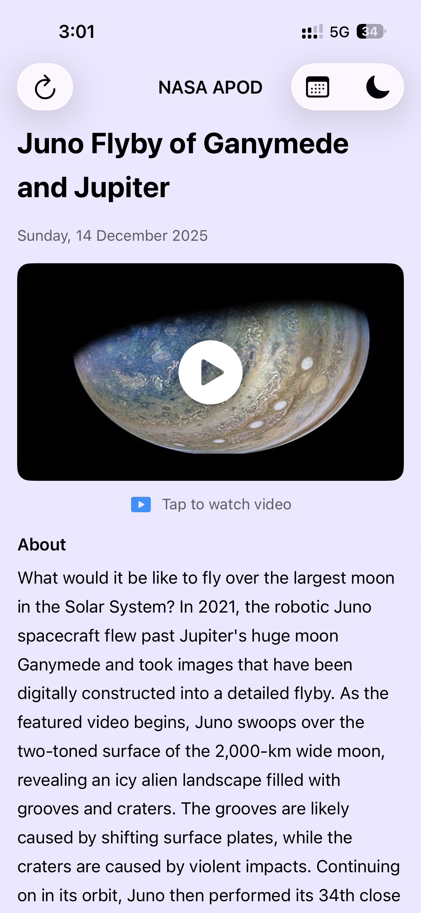
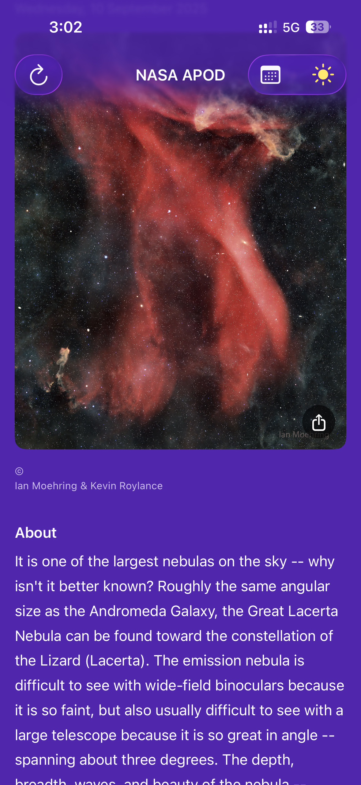
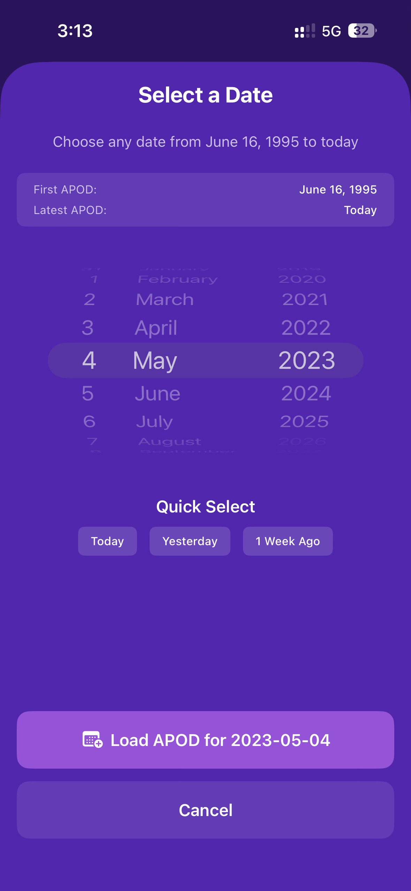
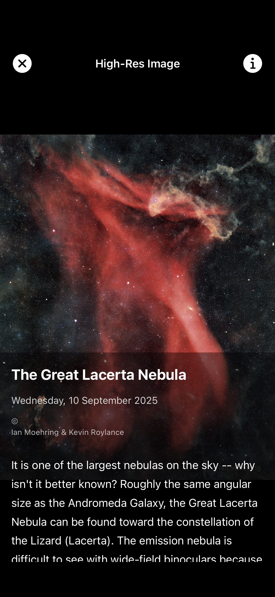

# NASA APOD Viewer

A native iOS application built with SwiftUI that displays NASA's Astronomy Picture of the Day (APOD).

## Features

### Core Functionality

#### API Integration
- Integrates with NASA's APOD API (`https://api.nasa.gov/planetary/apod`)
- Fetches and displays the Astronomy Picture of the Day
- Handles both image and video media types appropriately

#### Home Screen
- Displays today's APOD with:
  - Title
  - High-quality image (or video thumbnail for video content)
  - Explanation/description
  - Date
  - Copyright information (when available)

#### Date Selection
- Date picker to view APOD for any historical date
- Validates date selections (June 16, 1995 to present)
- Quick select buttons for Today, Yesterday, and 1 Week Ago

#### Image Detail View
- Full-screen image viewing experience
- Pinch-to-zoom support (1x to 5x magnification)
- Double-tap to zoom in/out
- Metadata overlay with title, date, copyright, and description

### Error Handling
- User-friendly error messages for:
  - Network failures
  - Invalid API responses
  - Invalid date selections
- Loading indicators during network requests
- Automatic retry mechanism

### Bonus Features

#### Image Caching
- Memory cache (NSCache) - 50 images, 50MB limit
- Avoids redundant network calls

#### Share Functionality
- Share button overlay on images

#### Dark Mode
- Inspired from 💜 **Aspora** Website Theme
- Full dark/light mode support
- Manual toggle button in navigation bar
- Custom theme colors:
  - Light mode: `#EBE6FF`
  - Dark mode: `#5523B2`
- Persists user preference

## Architecture

The app follows the **MVVM (Model-View-ViewModel)** architecture pattern:

## API Key

Get your free NASA API key at: https://api.nasa.gov/

## Screenshots

  
  
  
  

